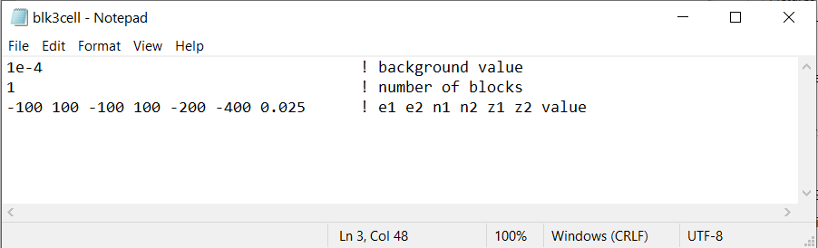
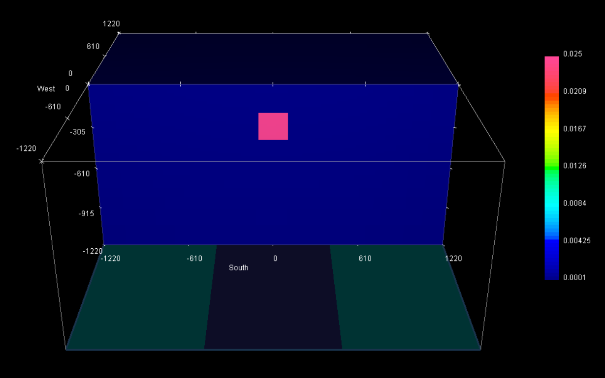

.. _example_model:

Create Model
============

Here the code **blk3cell.exe** and the input file **blk3cell.inp** are used to create a susceptibility model on the tensor mesh provided (**mesh.txt**). Files relevant to this part of the example are in the sub-folder *model*. Before running this example, you may want to do the following:

	- `Download and open the zip folder containing the entire mag3d example <https://github.com/ubcgif/mag3d/raw/master/assets/mag3d_example.zip>`__ (if not done already)
	- Learn how to `run blk3cell <https://mtz3d.readthedocs.io/en/latest/content/programs/createModel.html>`__ 
	- Learn the format of the `input file <https://mtz3d.readthedocs.io/en/latest/content/inputfiles/createModel.html>`__

Here is the input file used to generate the synthetic model.

The resulting tensor model shows a more susceptible block (:math:`\chi` = 0.025 SI) within minimally susceptible background (:math:`\chi_b` = 0.0001 SI). The region has a constant topography of 0 m.

