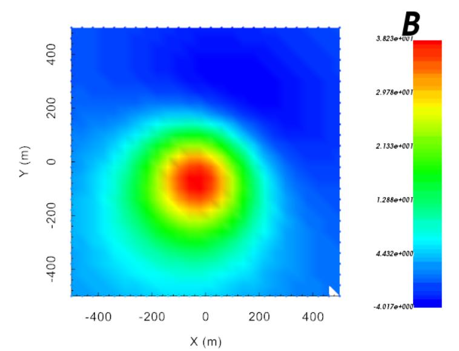

.. _example_fwd:

.. note:: This example has been developed to demonstrate functionality specific to v6.0. The example can be completed using v5.0, however some functionality may not exist in v5.0 and the format of certain input files may differ slightly.

Forward Modeling
================

Here the code **magfor3d_v60.exe** is used to forward model the magnetic anomaly for the mesh and susceptibility model provided. We consider an airborne survey with a uniform station spacing of 40 m and a flight height of 30 m. The inclination, declination and background field intensity are 60 degrees, 25 degrees and 50,000 nT, respectively.

Files relevant to this part of the example are in the sub-folder *fwd*. We used the same model that was created in the :ref:`create model <example_model>` section. Before running this example, you may want to do the following:

	- `Download and open the zip folder containing the entire mag3d example <https://github.com/ubcgif/mag3d/raw/master/assets/mag3d_example.zip>`__ (if not done already)
	- Learn how to run :ref:`magfor3d_v60 <magfor3d>`
	- There is no input file

The total magnetic intensity anomaly (nT) is shown below.

