Examples
========

In this section, we present synthetic examples to illustrate forward modelling and inversion capabilities of ``MAG3D v5.0``. Important functionalities of ``MAG3D v5.0`` are parallelization, the ability to handle borehole data, an increased freedom in the design of the model objective function, a faster procedure for incorporating constraints (using projected gradients), and the ability to check the accuracy of the wavelet compression for large scale problems. The synthetic examples described below are constructed to show these features. They are based on a synthetic model, which consists of a 500 meter susceptible cube in a half space, placed 300 m below the flat surface (:numref:`model`). Surface and multi-component borehole data are simulated. The examples can be downloaded directly from `here (14 MB) <http://www.eos.ubc.ca/~rshekhtm/examples/mag3dv5_example.zip>`__

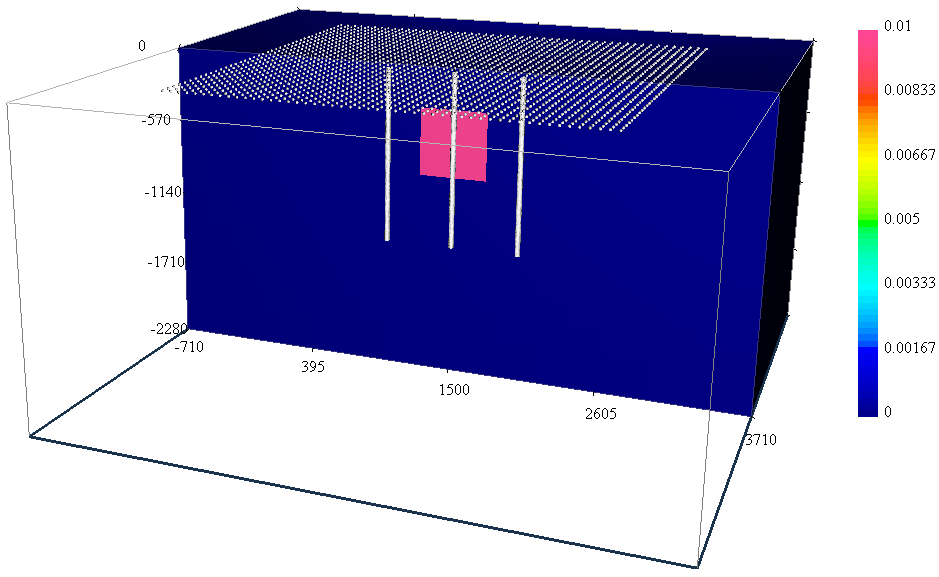

Forward modelling
-----------------

The surface data set consists of 2,091 evenly gridded data 60 meters Easting by 75 meters Northing (see :numref:`model`). The total-field anomaly was calculated at an inclination of :math:`65^\circ` and declination of :math:`25^\circ` with a field strength of 50,000 nT.

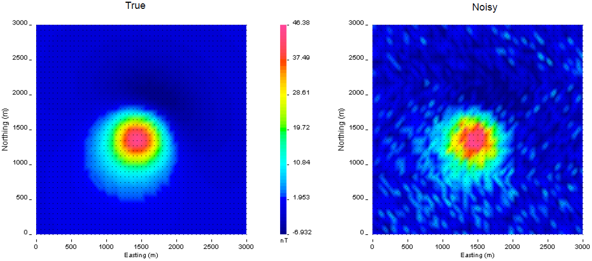

     The true data generated by a 500 m\ :math:`^3` block with a magnetic susceptibility of 0.01 SI (left). Gaussian noise with a floor of 3 nT and 2% of the data was added to create the observed data for the inversion (right).

In order run in this example, the following was put into the command line:

``magfor3d mesh.txt loc_surf.txt model.sus``

We next simulated the borehole data. The borehole data are calculated in three vertical holes located 500 meters apart east-west (:numref:`model`) with a depth interval of 20 meters for a total of 594 data. Each borehole accommodates 51 three-component measurements covering depth interval from 15 to 1,335 meters below surface. The command used to compute the simulated borehole data was:

``magfor3d mesh.txt loc_bh.txt model.sus``

The simulated data have been contaminated with Gaussian noise with a standard deviation of 3 nT plus 2% of the data. The noisy surface data are shown in :numref:`surfdata`. Figure :numref:`bhdata` shows the accurate and noisy borehole data.

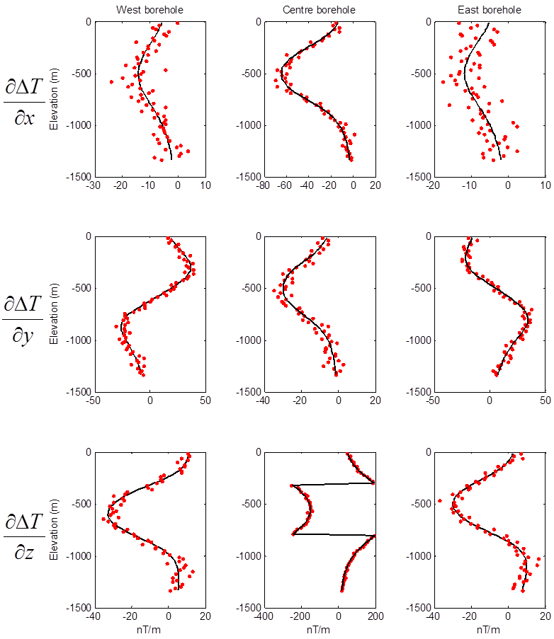
   
     Synthetic multi-component borehole data used in the inversions. Each column represents a single borehole and each row is the same component. The black lines are true data and red dots are the noisy data.

Inversion
---------

We illustrate the inversion of the surface data and then a joint inversion of surface and borehole data.

Default parameters
~~~~~~~~~~~~~~~~~~

First, the distance weighting function is calculated with :ref:`pfweight`. Distance weighting was chosen for consistency between the inversion of surface data and joint inversion of the surface and borehole data (borehole data require distance weighting). The input for the weighting function code is shown below. An example of the created log file is presented in :numref:`pfwghtLog`.

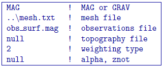
   

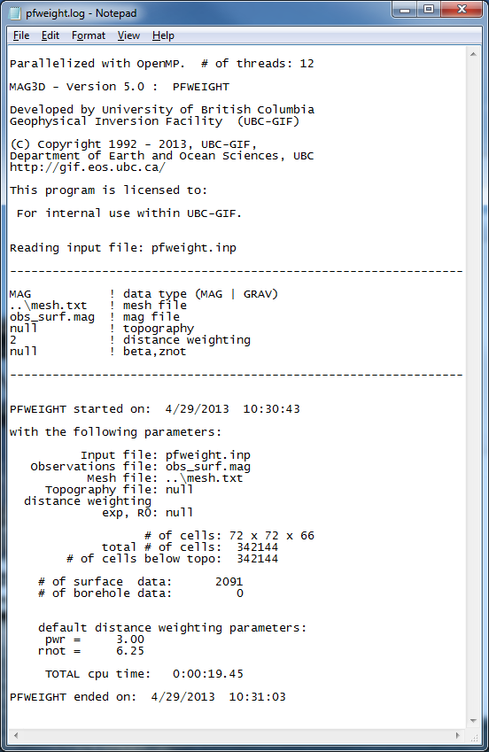
 
     The log file from :ref:`pfweight`. The information within this file reproduces the input file, gives the number of cells in the mesh and below topography, specifies the indices of borehole data within the data file (if applicable), and reports the time it took for the program to run or any errors that occurred.

Next, the sensitivity matrix is calculated with :ref:`magsen3d`.  The default wavelet compression parameters are used (``daub2`` with 5% reconstruction error (``eps=0.05``). We also choose *not* to output diagnostic parameters, although these are discussed in the :ref:`Wavelet diagnostic output <waveletExample>` section. With this scenario chosen, outputs and (these files will be over-written if the program has been run in the same folder more than once without re-naming them). The former file gives the user information about the sensitivity calculation such as compression ratio with the wavelet transform. The latter file will be required during the inversion process. The sensitivity will only have to be re-run if the mesh or data locations are changed. Changing the standard deviations does not require a new ``.mtx`` file. The log file from the sensitivity calculation is shown in :numref:`senslog`. The input file given to is shown below.

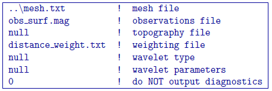

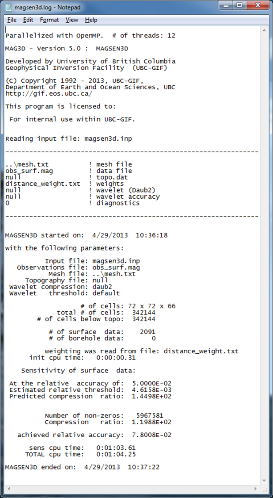

     The log file from :ref:`magsen3d`. The top information gives the input file information and version of the program. The bottom information describes how many cells are in the model after topography, how many data will be inverted, and how well the wavelet transform compressed :math:`\mathbf{G}`. Typical (and default) wavelet reconstruction error is 5% or 0.05 in the input file.

Once the matrix file is created, the inversion can be run by with a general input file. The control file example is provided below. The bounds are set to so positivity is enforced. Therefore, the initial model is set slightly above zero so that the entire model is included in the first iteration. The initial model is also usually set to the reference model so the reference model is set slightly above zero.

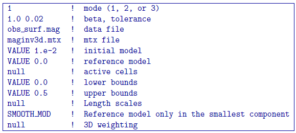

The inversion converges in four iterations. :numref:`convergence` shows the convergence curve for the data misfit versus the iteration number. The desired misfit is approximately 2100 and is achieved within the tolerance given (:math:`\pm2\%`). The predicted data from the recovered model is shown on the right of :numref:`recdata` with the observed data on the right for comparison.

An example log file created by within this example set (borehole and surface data) is shown in :numref:`invlog`. The file gives the input parameters and general information for every iteration such as the data misfit and iteration CPU time. A developers log (``maginv3d.out``) is also written (Figure [fig:developlog]). This file contains detailed information for every iteration including the beta parameter, data misfit, model norm and its components, total objective function, number of conjugate gradient iterations, and the number of truncated cells. The latter is the amount of cells that are at or beyond the bounds and are not included in the minimization with the projected gradient. In this case, it would be cells at or below zero that were set to zero.

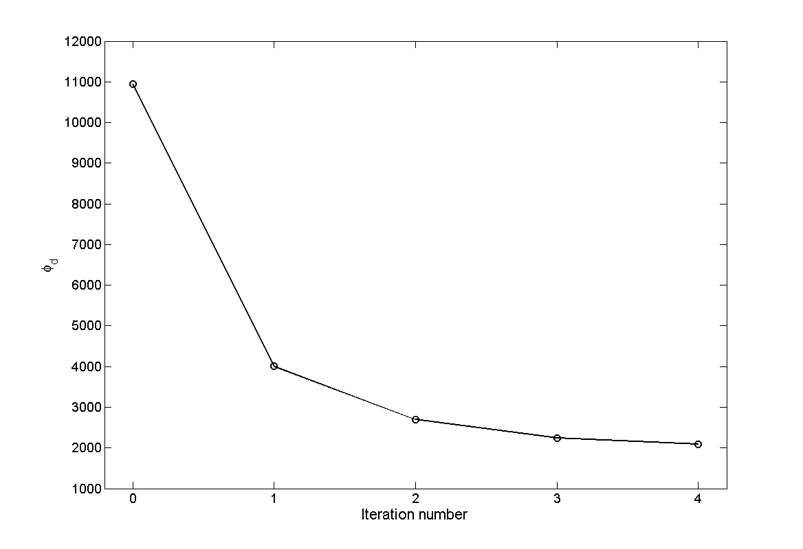

   The convergence curve for for the inversion of surface data. The 0\ :math:`^{th}` iteration is the initial misfit. The target misfit is approximately 2,100 where the inversion stops.

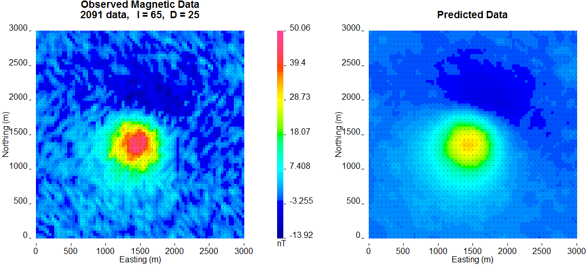
   
    The observed surface data (left) and the surface data created from the recovered model (right). The data are on the same colour scale.

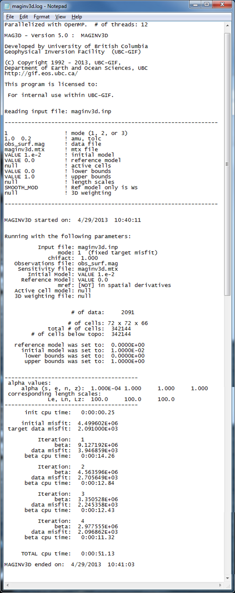
   
   The inversion log created by :ref:`maginv3d` . As with the sensitivity log file, the top portion of the file gives the input parameters so the results can be reproduced. The bottom gives details for each iteration such as the trade-off parameter, data misfit, and CPU time.

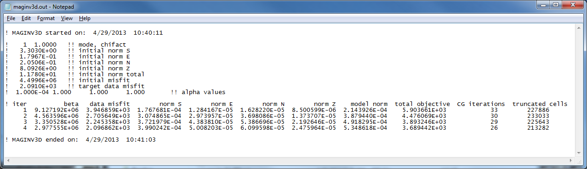

    The developer's log created by :ref:`maginv3d` (``maginv3d.out``). The top portion shows the start time and date and the details of the inversion at each iteration: beta, data misfit, model norm in each direction, total objective function, CG iterations, and the number of truncated cells within the projected gradient routine. The ending data and time is also written to file to be able to match with the simplified log file.

A slice of the recovered model through the centre of the anomalous body is presented in :numref:`addBorehole` (top). The recovered anomaly has smaller amplitude and is smoothed relative to the true model. The two boreholes that do not intersect the anomaly are then added. The data are inverted with the same parameters as previously given for the surface-only example and achieves the appropriate data misfit. The recovered model is shown in  :numref:`addBorehole` (middle). The anomalous body is tighter and a bit more constrained with the addition of subsurface data. Finally, data from the third borehole that intersects the anomaly are added to the observed data. An interesting observation from the recovered model (:numref:`addBorehole` ; bottom) is the lack of magnetic susceptibility where the borehole is physically located.

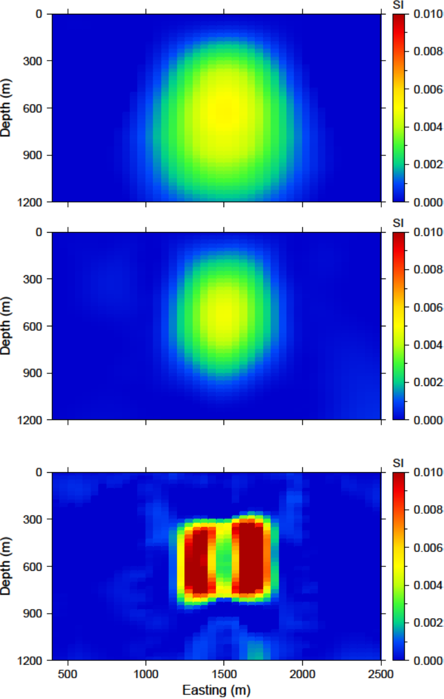

   Cross sections of the recovered models from (top) surface data only, (middle) surface data and data from the east and west boreholes, and (bottom) surface data and data from all three boreholes. The addition of borehole data aids by increasing the amplitude of the recovered anomaly and its compactness. The middle of the anomaly lacks susceptibility when the borehole that intersects the anomaly is used. Therefore, the recovered model has even higher susceptibility enabling the solution to reproduce the data.

There are two different types of constraints that can be used in order to recover an anomalous body near the borehole that physically intersects it. Those types are soft or hard constraints. Soft constraints are applied through the model objective function and hard constraints are provided through active and inactive cells, and bounds. The following two sections apply each one of these types of constraints, respectively, in order to alleviate this problem.

Use of soft constraints
~~~~~~~~~~~~~~~~~~~~~~~

One type of constraints that can be used to connect the body for a more realistic interpretation is soft constraints. We examine both the use of distance weighting and the reference model through the :ref:`model objective function <mof>`.

Distance weighting
__________________

Distance weighting is utilized to avoid placing susceptible cells near the observation locations where the mesh has a higher sensitivity and can bias the final solution. We therefore manually change the :math:`R_o` in the :ref:`distance weighting <distWeight>` in the input file from the default value of :math:`1/4` of a cell to 100 - much larger than what is needed. Since the values are then normalized, this will allow susceptible material near the borehole locations. The :math:`\alpha` value should be 3.0 due to the field decay to a cubic power. The sensitivity and inversion input files stay the same. The weighting input file for this example is

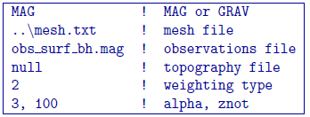

The inversion is run with all three boreholes and surface data. A slice of the recovered model is shown in Figure [fig:all\_ro]. The recovered model has a single anomaly as desired. The anomaly is near the true susceptibility (0.01 SI) and has a block-like shape. A by-product of using this weighting is that the algorithm is able to place susceptibility not only near the borehole locations, but also near surface observations. To improve upon the results, we examine the use of the reference model with this weighting in order to centralize the anomalous susceptibility.

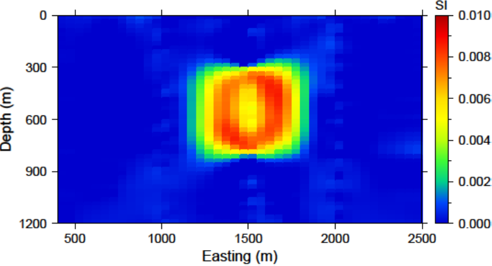

    The recovered model after increasing the distance weighting function during the sensitivity calculation. The :math:`R_o` was increased to 100. The anomaly is near the true susceptibility but lacks continuity throughout the anomalous volume.

Reference model
_______________

As previously discussed in the :ref:`inversion methodogy <invMethod>`, the reference model can either be incorporated into the spatial derivatives or only the smallest model component of the model objective function. We use the :ref:`magsen3d` input file from distance weighting and examine the differences in the recovered model with the addition of the reference model.

The centre borehole intersects the anomaly so we assume that we know the true model at the location of those subsurface observations. The reference model is then designed so that everywhere else it promotes a zero model. A cross section of the reference model is shown in :numref:`refModel` (top). Only the cells that the borehole intersects the anomaly are given as susceptibilities over zero.

The input file for the inversion with the reference model throughout model objective function is shown below. The initial model is the same as the reference model and the choice ``SMOOTH_MOD_DIF`` is invoked in order to place the reference model in the spatial derivatives.

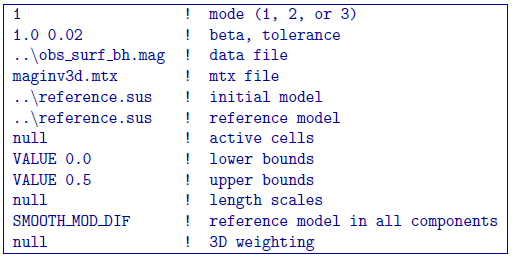
   
The recovered model is found in :numref:`refModel` (middle). There is a single anomaly with the maximum amplitude where the non-zero portion of the reference model influenced the solution. The surrounding part of the body goes to zero to try to minimize the difference spatially leaving a strip where the non-zero part of the reference model is located. In this light, the affects of penalizing the derivatives with the reference model included become apparent.

Next, the input file for the inversion is changed so that the option ``SMOOTH_MOD`` is used in order to place the reference model only in the smallest component of the model objective function. A cross section of the recovered model with this option is presented in  :numref:`refModel` (bottom). This time the recovered anomaly is much more homogeneous and is closer to the true model throughout the body. The solution is similar to just the distance weighting, though it recovers higher susceptibilities and does not decrease in amplitude as much within the anomalous volume.

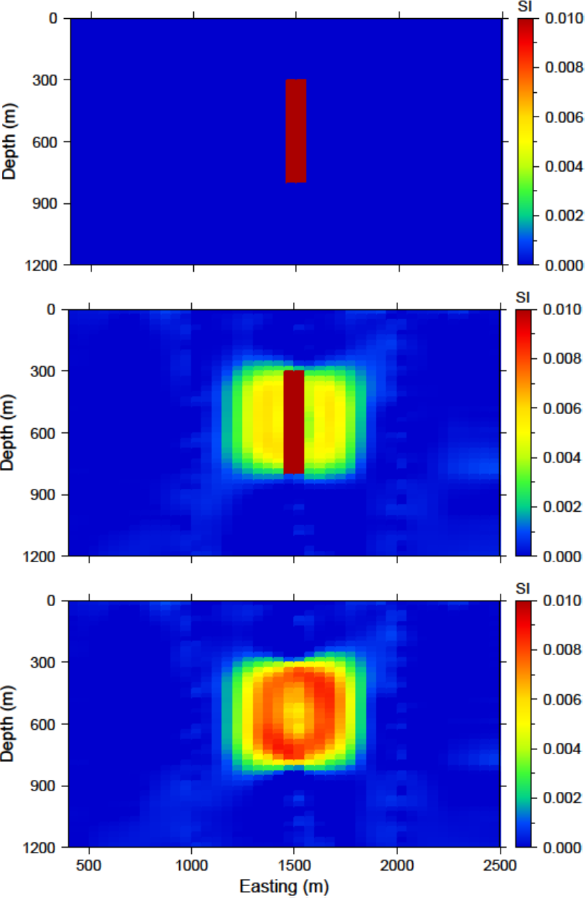

    (top) The reference model used from prior information given in the boreholes. The reference model can be utilized (middle) throughout all derivatives of the model objective function or (bottom) just in the smallest model component.

Use of hard constraints
~~~~~~~~~~~~~~~~~~~~~~~

The last section discussed the flexibility of the model objective function to influence the result of :ref:`maginv3d`. This section examines the use of hard constraints that strictly enforce a range of values rather than promote the values mathematically. We first incorporate bound constraints and then set key cells to be inactive within the inversion.

Bounds cells
____________

To be able to appropriately bound the model, we examine the susceptibility given by the borehole information. The bound model file is two columns and requires a lower and upper bound, respectively. For the lower bound, we set the model to zero everywhere but the intersection of the anomaly with the centre borehole. The true model is observed here, so we set the bounds in this region to 0.0099 - just below the 0.01 of the anomalous body (:numref:`addBounds` ; top). The upper bounds are 1 (i.e. positivity only) everywhere but in the locations of the zero susceptibility found in the boreholes. This model can be found in :numref:`addBounds` (bottom). These two models create the bounds file. We use the same reference model from the soft constraints section. The reference model is only incorporated in the smallest model component of the model objective function. The input file for the inversion with bounds is

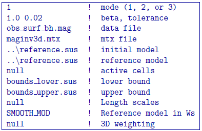

and a cross section of the recovered model is found in :numref:`addBounds` (bottom). The bounds force the model to the correct 0.01 SI values where the centre borehole intersects the anomalous body, to zero where the boreholes do not intersect any susceptibility, and allows the rest of the model to change as necessary. This results in large values in the centre of the anomaly with smoothly decaying amplitudes towards the outsides of the body. The shape is still correctly recovered. 

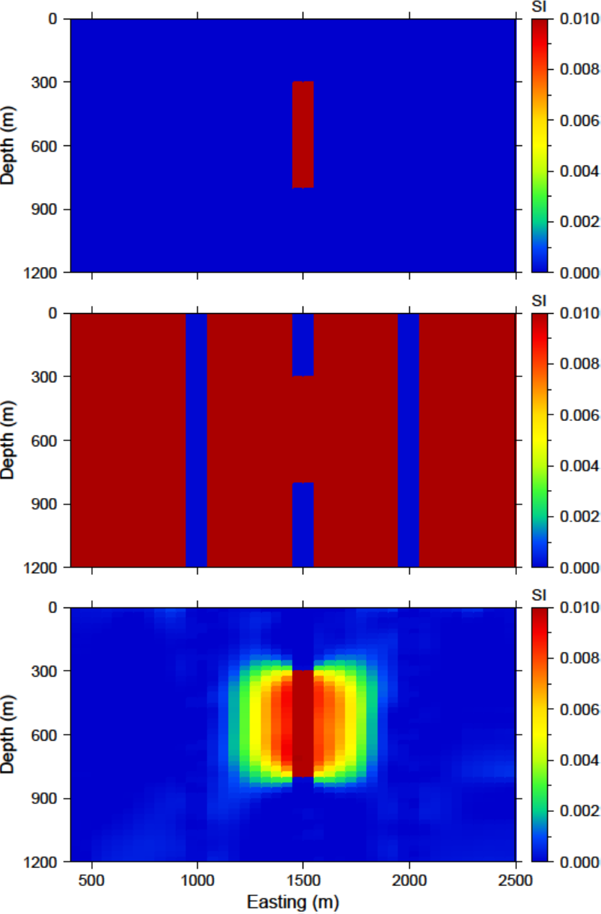

    (top) The lower bounds are zero everywhere but the intersecting section of the centre borehole. (middle) The upper bounds are 0.0001 where no susceptibility was found in the boreholes, 0.0101 in the centre borehole where the anomaly is, and 1 everywhere else in the model effectively enforcing only positivity. (c) The recovered model with bounds and an initial model.

Active/inactive cells
_____________________

An added functionality of :ref:`maginv3d` is the ability to set cells to a prescribed value and not to incorporate them directly into the inversion. For this example, the model cells in the boreholes are set to inactive. This means they will stay the value given in the initial model and will not be part of the model objective function (they will contribute to the produced data of the solution). For this example, we set the active cells with values of 1 near the boreholes where the inversion will solve for susceptibility. The cells intersecting the boreholes where susceptibility is known is set to :math:`-1` in order to influence the model objective function, yet set the cell values. The cells outside the region of interest and that we know have no anomalous susceptibility are set to :math:`0` (also inactive) and are not included within the inversion. :numref:`activeCells` (top) is a cross section of the active cell model. The reference model determines the cell values within the inactive region so the file ``reference.sus`` is used. An initial model using the reference model is also set. The inversion input file for this example is

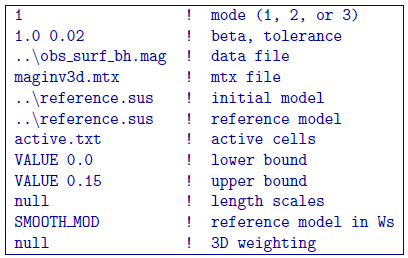

The recovered model is shown in :numref:`activeCells` (bottom). The centre of the anomaly has the expected value of 0.01 (it was not part of the inversion) and the surrounding susceptibility expands to the region of the true anomalous body continuously due to keeping the reference model in the smallest model component of the model objective function. Active cells can improve the inversion when prior information is available.

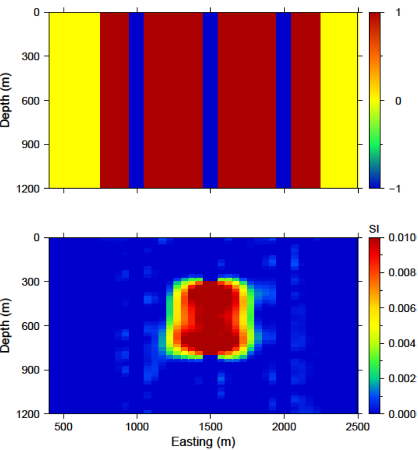

    (top) The inactive (-1 and 0) and active (1) cells that are incorporated into the inversion. The reference model sets the values of the inactive cells. The inactive cells set to -1 influence the model objective function. (bottom) A cross section of the recovered model given the inactive cells with the true susceptibility values.

.. _waveletExample:

Wavelet diagnostic tests
------------------------

In this section, we discuss two approaches to try to understand the influence of the wavelet compression on the recovered model. The diagnostic test output from is first examined. Then, we show how to perform similar experiments through the combination of ref:`magfor3d` and :ref:`magpre3d`.

Running magsen3d diagnostic test tool
~~~~~~~~~~~~~~~~~~~~~~~~~~~~~~~~~~~~~

In order to run the diagnostic test via :ref:`magsen3d`, a ``1`` is given on the bottom line of the input file. The weighting code is run prior to the sensitivity and the sensitivity matrix output can be used (as if the test was not run) in the inversion. It should be noted that the testing can require up to twice the CPU time compared to running the sensitivity matrix calculation alone. Once the diagnostic testing begins, the user may decide to stop the code. In that case, the testing files are not output yet the matrix file has been written and the inversion process can proceed. An example input file for the sensitivity calculation with testing is

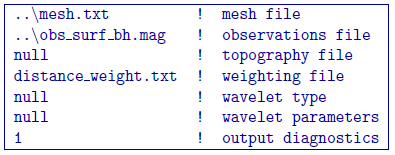

The standard outputs of running are the sensitivity matrix file (``maginv3d.mtx``), the average sensitivity for each cell (``sensitivity.txt``), and the log file (``magsen3d.log``). The average sensitivity for each cell is a model file and can be viewed in `meshTools3D <http://gif.eos.ubc.ca/software/utility_programs#3DmodelsMeshes>`__. The average sensitivity is calculated from the *full, non-compressed* sensitivity. Running the diagnostic test performs this calculation on the *compressed* sensitivity and outputs the file ``sensitivity_compressed.txt``. The true compression error is also given in the log file with this setting to be able to compare to the given compression error tolerance (e.g. ``0.05``).

Examining how the two average sensitivity models differ can give insight on how well the wavelet compression has performed. The general shape should be the same, but large jumps in cell size can create large differences, which will be observed with the two outputs. :numref:`compComp` (top) shows a cross-section of the uncompressed sensitivity average for the block example given in this manual. The same cross-section for the compressed average sensitivity for a 5% reconstruction error is presented in  :numref:`compComp` (middle). In general, the compression shows good accuracy. The difference between the two models is given in :numref:`compComp` (bottom) for reference. All of the pictures are shown in log scale. 

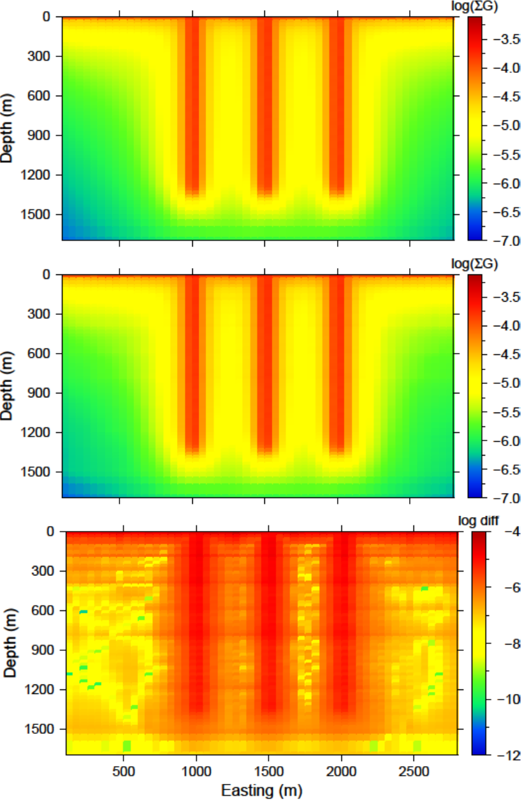

    (top) The log of average sensitivity for each cell prior to compression. (middle) the log of average sensitivity for each cell after compression with a 95% reconstruction accuracy. (bottom) The difference between (top) and (middle) on a log scale.

The data from the compressed and uncompressed sensitivity given a constant model of 0.01 is also written, aptly named ``data_compressed.txt`` and ``data_uncompressed.txt`` respectively. This also gives insight to the differences in column-based integration of the compressed and uncompressed sensitivity matrix. However, the model output is much more intuitive.

Recovered model-based diagnostic test
~~~~~~~~~~~~~~~~~~~~~~~~~~~~~~~~~~~~~

Users of the package often are curious how the wavelet transform is affecting the predicted data. Although the diagnostic test does this calculation on a constant model of 0.1, this test is actually easy to perform once the inversion code has a solution. The ``maginv3d_xxx.pre`` is the predicted data for the compressed sensitivity and can also be calculated with the code given a file and a recovered model. To obtain the predicted data for an uncompressed sensitivity matrix, run :ref:`magfor3d` on the recovered model, ``maginv3d_xxx.sus``. The difference between the generated data sets will show how the wavelet compression is affecting the final data. Large discrepancies in the data may suggest the use of a smaller reconstruction error given on the ``eps`` line of the sensitivity input file. An example is shown using the surface-only data set. The two data sets for the uncompressed, compressed sensitivity matrix, and their difference is respectively shown in :numref:`dataComp`. The maximum difference between the two data sets less than is 1 nT.

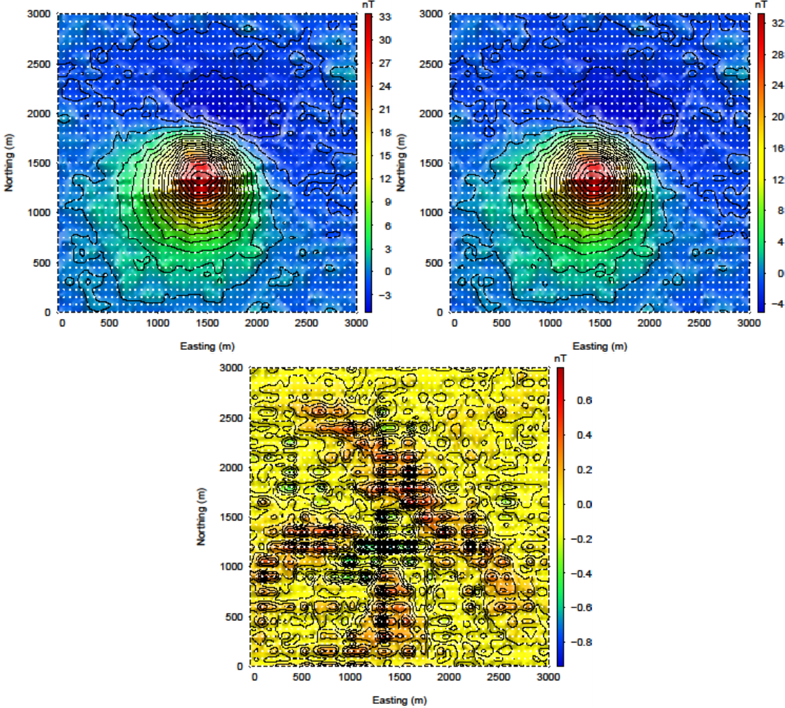
    
    (top-left) The predicted data from the uncompressed sensitivity matrix by using magfor3d on the recovered model. (top-right) The predicted data from the compressed sensitivity matrix given by maginv3d or calculated by magpre3d given the recovered model. (bottom) The difference of the two data sets is less than 1 nT. Data locations are denoted by the white dots.

