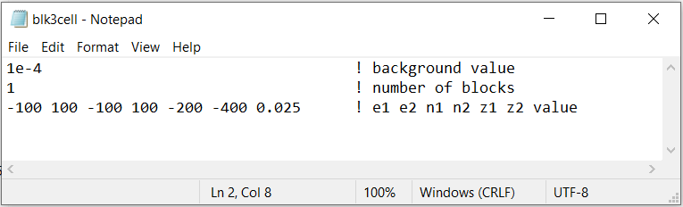
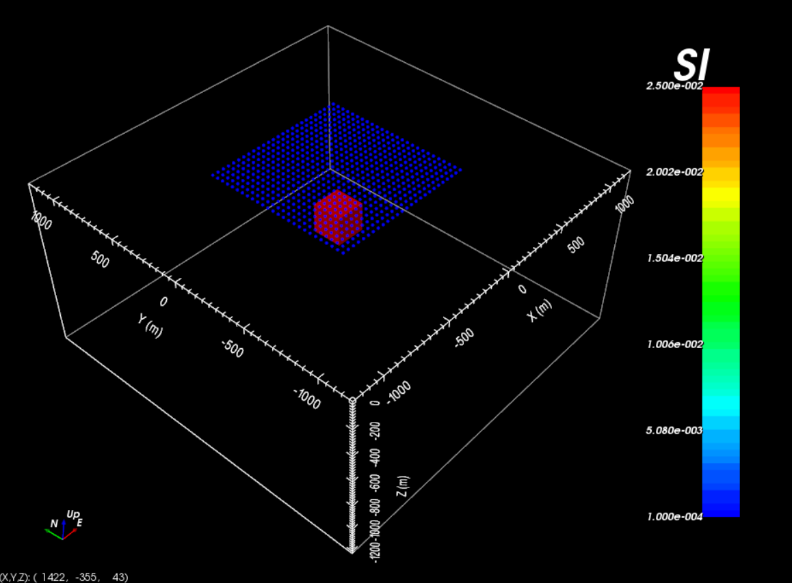

.. _example_amp_model:

Create Model
============

Here, the code **blk3cell.exe** is used to construct a magnetic susceptibility model on the tensor mesh provided. Files relevant to this part of the example are in the sub-folder *create_model*. Before running this example, you may want to do the following:

    - `Download and open the zip folder containing the entire Mag3d example <https://github.com/ubcgif/mag3d/raw/v6/assets/mag3d_v6_amp_example.zip>`__ (if not done already)
    - Learn how to run :ref:`blk3cell<mag3d_blk3cell>`
    - Learn the format of the input files :ref:`blk3cell.inp<mag3d_blk3cell_input>`

For our example, the input file used to create the susceptibility model is shown below (**blk3cell.inp**)

The resulting model shows a more susceptible block (:math:`\kappa` = 0.025 SI) inside a much less susceptible background (:math:`\kappa` = 0.0001 SI).
The locations used to model the data are shown as well.

