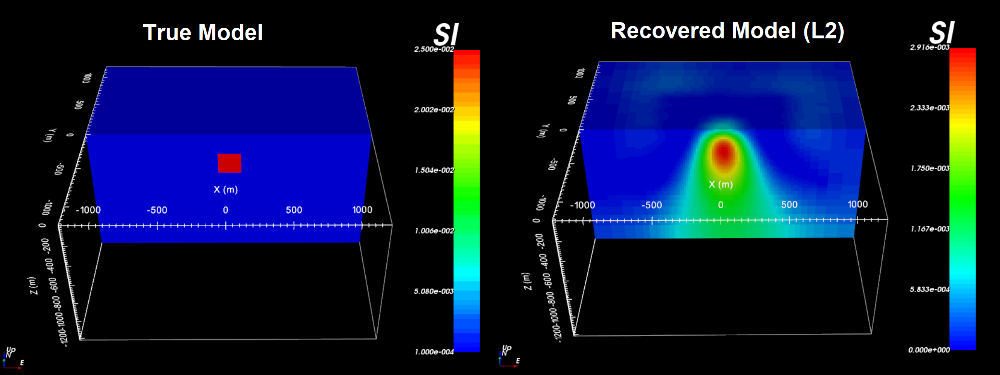

.. _example_amp_inv_L2:

.. note:: The latest example has been generated using MAG3D v6.0.2. The exercise can be completed using previous versions. However, improvements in performance since v6.0 and v6.0.1 may result in slightly different recovered models.

Least-Squares Inversion
=======================

Here, we use **magsen3d_60.exe** to compute the sensitivity matrix required for the inversion; which is scaled by distance weighting. We then use **maginv3d_60.exe** to perform a least-squares inversion and recover a susceptibility model. To keep the example simple, we added Gaussian noise with a standard deviation of 0.5 nT to all data points. We then assigned uncertainties of 0.5 nT to all magnetic data. In practice, the noise on the data is not trivial to quantify and choosing appropriate uncertainties is very important for successful inversion.

Files relevant to this part of the example are in the sub-folder *inv_L2* . Before running this example, you may want to do the following:

    - `Download and open the zip folder containing the entire Mag3d example <https://github.com/ubcgif/mag3d/raw/v6/assets/mag3d_v6_amp_example.zip>`__ (if not done already)
    - Learn how to run :ref:`magsen3d_60.exe <mag3d_sens>` and :ref:`maginv3d_60.exe <mag3d_inv>` from the command line
    - Learn the format of the :ref:`input file for magsen3d_60.exe <mag3d_sens_input>` and of the :ref:`input file for maginv3d_60.exe <mag3d_inv_input>`

Sensitivities
-------------

Here, the code **magsen3d_60.exe** and the input file **sens.inp** (:ref:`see format <mag3d_sens_input>`) are used to construct the sensitivity matrix and scale it using distance weighting. The distance weighting is applied to the sensitivity matrix to counteract the inversion's natural tendancy to incorrectly place anomalous structures near the observation locations. 

To compute the sensitivities, the following input file was used. Since we are performing a least squares inversion, a flag of *1* is entered on the last line of the input file.

.. note:: If using MAG3D v6.0.2, the last line in the input file is unused and the sensitivity matrix can be used for either L2 or sparse-norm inversion.

.. figure:: ../inputfiles/images/create_sens_L2_input.png
     :align: center
     :width: 700

Inversion
---------

Here, the code **maginv3d_60.exe** and the input file **inv.inp** (:ref:`see format<mag3d_inv_input>`) was used to recover a susceptibility model. You cannot perform the inversion until you have created the sensitivity matrix.

.. figure:: ../inputfiles/images/create_inv_L2_input.png
     :align: center
     :width: 700

The true model (left) and the final recovered model (right) are shown below. The least-squares inversion almost always recovers a smooth structure that underestimates the amplitude of the target. With distance weighting however, the center location of the recovered body is consistent with the true model.

