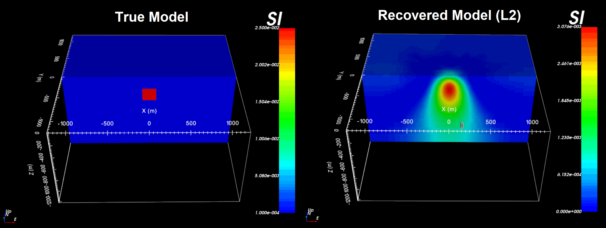

.. _example_tmi_inv_L2:

Least-Squares Inversion
=======================

Here, we use **magsen3d_60.exe** to compute the sensitivity matrix required for the inversion; which is scaled by distance weighting. We then use **maginv3d_60.exe** to perform a least-squares inversion and recover a susceptibility model. To keep the example simple, we added Gaussian noise with a standard deviation of 0.5 nT to all data points. We then assigned uncertainties of 0.5 nT to all magnetic data. In practice, the noise on the data is not trivial to quantify and choosing appropriate uncertainties is very important for successful inversion.

Sensitivities
-------------

Here, the code **magsen3d_60.exe** and the input file **sens_L2.inp** (:ref:`see format <mag3d_sens_input>`) are used to construct the sensitivity matrix and scale it using distance weighting. The distance weighting is applied to the sensitivity matrix to counteract the inversion's natural tendancy to incorrectly place anomalous structures near the observation locations. Files relevant to this part of the example are in the sub-folder *sensitivity_L2* . Before running this example, you may want to do the following:

    - `Download and open the zip folder containing the entire Mag3d example <https://github.com/ubcgif/mag3d/raw/v6/assets/mag3d_v6_tmi_example.zip>`__ (if not done already)
    - :ref:`Learn how to run code from command line <mag3d_sens>`
    - :ref:`Learn the format of the input file <mag3d_sens_input>`

To compute the sensitivities, the following input file was used. Since we are performing a least squares inversion, a flag of *1* is entered on the last line of the input file.

.. figure:: ../inputfiles/images/create_sens_L2_input.png
     :align: center
     :width: 700

The distance weighting applied to the inversion is output by **magsen3d_60.exe** and is shown below.

.. figure:: images/sensitivity.PNG
     :align: center
     :width: 700

Inversion
---------

Here we use the code **maginv3d_60.exe** to recover a susceptibility model. Before running the example, you may want to:

    - `Download and open the zip folder containing the entire Mag3d example <https://github.com/ubcgif/mag3d/raw/v6/assets/mag3d_v6_tmi_example.zip>`__ (if not done already)
    - :ref:`Learn how to run code from command line <mag3d_inv>`
    - :ref:`Learn the format of the input file <mag3d_inv_input>`

Most files relevant to this part of the example are in the sub-folder *inv_L2*. **However, you must** move the sensitivity matrix file output by *magsen3d_60.exe* (i.e. *maginv3d.mtx*) from sub-folder *sensivitity_L2* to sub-folder *inv_L2*, or change the path to *maginv3d.mtx* in the input file. To invert the synthetic data, the input file below (**inv_L2.inp**) was used.

.. figure:: ../inputfiles/images/create_inv_L2_input.png
     :align: center
     :width: 700

The true model (left) and the final recovered model (right) are shown below. The least-squares inversion almost always recovers a smooth structure that underestimates the amplitude of the target. With distance weighting however, the center location of the recovered body is consistent with the true model.

