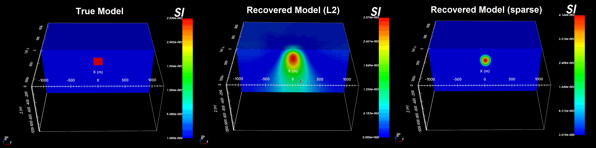

.. _example_tmi_inv_sparse:

Sparse Norm Inversion
=====================

Here, we use **magsen3d_60.exe** to compute the sensitivity matrix required for the inversion; which is scaled by distance weighting. We then use **maginv3d_60.exe** to invert the data using sparse norms to recover a model compact susceptibility model. To keep the example simple, we added Gaussian noise with a standard deviation of 0.5 nT to all data points. We then assigned uncertainties of 0.5 nT to all magnetic data. In practice, the noise on the data is not trivial to quantify and choosing appropriate uncertainties is very important for successful inversion.

Sensitivities
-------------

Here, the code **magsen3d_60.exe** and the input file **sens_sparse.inp** (:ref:`see format <mag3d_sens_input>`) are used to construct the sensitivity matrix and scale it using distance weighting. The distance weighting is applied to the sensitivity matrix to counteract the inversion's natural tendancy to incorrectly place anomalous structures near the observation locations. Files relevant to this part of the example are in the sub-folder *sensitivity_sparse* . Before running this example, you may want to do the following:

    - `Download and open the zip folder containing the entire Mag3d example <https://github.com/ubcgif/mag3d/raw/v6/assets/mag3d_v6_tmi_example.zip>`__ (if not done already)
    - :ref:`Learn how to run code from command line <mag3d_sens>`
    - :ref:`Learn the format of the input file <mag3d_sens_input>`

To compute the sensitivities, the following input file was used. Since we are no longer performed an least-squares inversion, a flag of *0* must be entered on the last line of the input file.

.. figure:: ../inputfiles/images/create_sens_sparse_input.png
     :align: center
     :width: 700

The distance weighting applied to the inversion is output by **magsen3d_60.exe** and is shown below. You may notice that the distance weighting remains the same whether or not you are inverting with sparse norms.

.. figure:: images/sensitivity.PNG
     :align: center
     :width: 700

Inversion
---------

Here we use the code **maginv3d_60.exe** to recover a susceptibility model. Before running the example, you may want to:

    - `Download and open the zip folder containing the entire Mag3d example <https://github.com/ubcgif/mag3d/raw/v6/assets/mag3d_v6_tmi_example.zip>`__ (if not done already)
    - :ref:`Learn how to run code from command line <mag3d_inv>`
    - :ref:`Learn the format of the input file <mag3d_inv_input>`

Most files relevant to this part of the example are in the sub-folder *inv_sparse*. **However, you must** move the sensitivity matrix file output by *magsen3d_60.exe* (i.e. *maginv3d.mtx*) from sub-folder *sensivitity_sparse* to sub-folder *inv_sparse*, or change the path to *maginv3d.mtx* in the input file. 

To invert the synthetic data, the input file below (**inv_sparse.inp**) was used. For this example, we set *P=0* and *Qx=Qy=Qz=2*. That is, we would like to recover a model that is compact but still smooth. To see how these parameters impact the recovered model, see the `GIFtools cookbook <https://giftoolscookbook.readthedocs.io/en/latest/content/fundamentals/Norms.html>`__ .

.. figure:: ../inputfiles/images/create_inv_sparse_input.png
     :align: center
     :width: 700

The true model (left), recovered model using least-squares (middle) and recovered model using sparse norms (right) are shown below. Unlike the least-squares result, the sparse norm result is a compact structure whose maximum amplitude is much closer to that of the true model. And the distance weighting is able to place the center of the recovered model at the correct depth.

