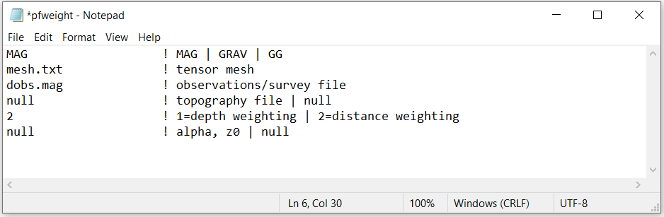
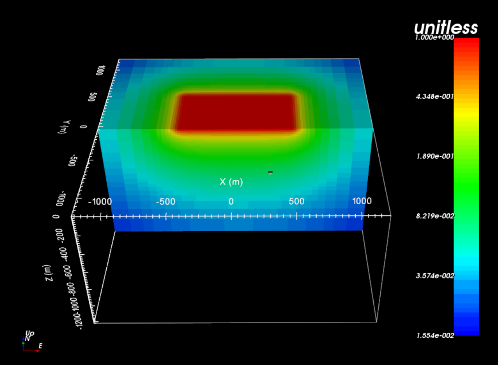

.. _example_tmi_weights:

Depth/Distance Weighting
========================

Here the code **pfweight.exe** and the input file **pfweight.inp** is used to generate distance weighting for the inversion. Files relevant to this part of the example are in the sub-folder *pfweights*. Before running this example, you may want to do the following:

	- `Download and open the zip folder containing the entire Mag3d example <https://github.com/ubcgif/mag3d/raw/v6/assets/mag3d_v6_amp_example.zip>`__ (if not done already)
	- Learn how to :ref:`run pfweight <mag3d_pfweight>`
	- Learn the format of the :ref:`input file <mag3d_weight_input>`

Here is the input file for **pfweight.exe**

The resulting distance weights are plotted on the mesh below.

