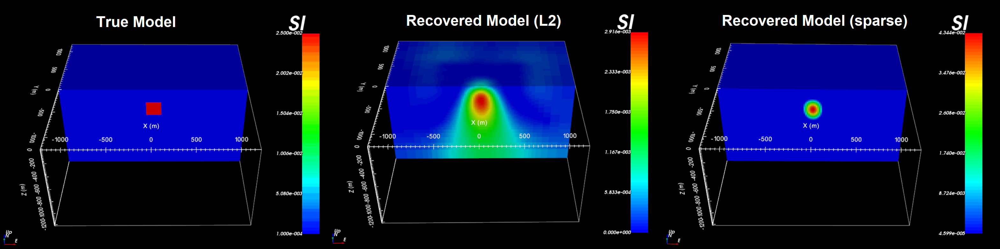

.. _example_amp:

.. note:: The latest example has been generated using MAG3D v6.0.2. The exercise can be completed using previous versions. However, improvements in performance since v6.0 and v6.0.1 may result in slightly different recovered models.

Example with Amplitude Data
===========================

Here, the program library for MAG3D v6 will be used to:

    - create a susceptibility model on a tensor mesh
    - forward model magnetic data for a given survey and model
    - construct the sensitivity matrix and weights that will be used in the inversion
    - invert the magnetic data to recover a susceptibility model
    - demonstrate how to perform a least-squares as well as a sparse norm inversion

Zip folders containing all necessary files can be downloaded here:

    - `Download and open the zip folder containing the entire Mag3d example <https://github.com/ubcgif/mag3d/raw/v6/assets/mag3d_v6_amp_example.zip>`__

The full example is parsed into 5 sections:

.. toctree::
    :maxdepth: 1

    Create susceptibility model <example_amp/create_model>
    Forward modeling <example_amp/fwd>
    Distance/depth weighting <example_amp/weights>
    Least-squares inversion <example_amp/inv_L2>
    Sparse-norm inversion <example_amp/inv_sparse>