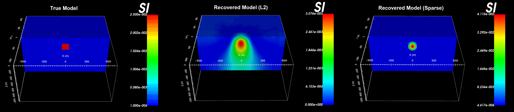

.. _example_tmi:

Example with TMI Data
=====================

Here, the program library for Mag3d v6.0 will be used to:

    - create a susceptibility model on a tensor mesh
    - forward model TMI data for a given survey and model
    - construct the sensitivity matrix and weights that will be used in the inversion
    - invert the magnetic data to recover a susceptibility model
    - demonstrate how to perform a least-squares as well as a sparse norm inversion

Zip folders containing all necessary files can be downloaded here:

    - `Download and open the zip folder containing the entire Mag3d example <https://github.com/ubcgif/mag3d/raw/v6/assets/mag3d_v6_tmi_example.zip>`__

The full example is parsed into 4 sections:

.. toctree::
    :maxdepth: 1

    Create susceptibility model <example_tmi/create_model>
    Forward modeling <example_tmi/fwd>
    Least-squares inversion <example_tmi/inv_L2>
    Sparse-norm inversion <example_tmi/inv_sparse>

