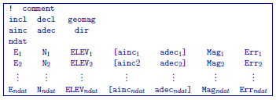
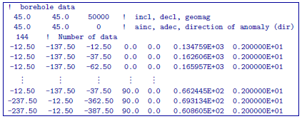
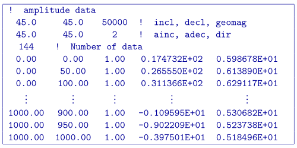

.. _magfile:

Magnetic observations file
==========================

Here, we demonstrate the format of the survey, predicted data and observations files that are compatible with **magfor3d_60.exe** and **maginv3d_60.exe**. For forward modeling, the survey file will contain the observation locations, the properties of the Earth's field, the definition of the data type (TMI or amplitude) and optional columns for defining magnetizations that are not along the Earth's field. In addition to this information, the predicted data file will contain an additional column containing the data predicted for a given model. Observation files will contain a data column as well as a column for the uncertainties on the data.

The general format for data files compatible with **magfor3d_60.exe** and **maginv3d_60.exe** is as follows:

Parameter Definitions
^^^^^^^^^^^^^^^^^^^^^

    - *!:* Any line beginning with a ! is ignored an represents a comment line.

    -  **incl, decl** and **geomag:** Defines the orientation and intensitity of the Earth's magnetic field. *incl* is the inclination, *decl* is the declination and *geomag* is the intensity in nT.

    - **ainc, adec** and **dir:** Defines the orientation of the magnetization of the cells and defines the data columns in the file. 
  
        - *dir=0*: The data are TMI data projected along the direction defined by the Earth's field (i.e. *incl* and *decl*). In this case, the parameters *ainc* and *adec* are ignored. The user must define the magnetization direction for each cell independently by including the two optional columns ( [:math:`ainc_i \;\, adec_i`] ). *Note that for each cell, you assume the magnitude of the magnetization is* :math:`\kappa B_0 / \mu_0`.
        
        - *dir=1*: The data are TMI data projected along the direction defined by the Earth's field (i.e. *incl* and *decl*). In this case, the parameters *ainc* and *adec* define the magnetization direction that is used for all cells. If the magnetization is strictly induced (no remanence), we set *ainc* and *adec* to be the same as *incl* and *decl* on the previous line. Therefore we do not include the two optional columns ( [:math:`ainc_i \;\, adec_i`] ) .

        - *dir=2*: The data are amplitude data. In this case, the parameters *ainc* and *adec* define the magnetization direction that is used for all cells. If the magnetization is strictly induced (no remanence), we set *ainc* and *adec* to be the same as *incl* and *decl* on the previous line. Once again, we do not include the two optional columns ( [:math:`ainc_i \;\, adec_i`] ) .

    - **ndat:** Number of observation locations.

    - **E, N, ELEV:** Easting, Northing and elevation for each observation location in meters. Elevation should be above the topography for surface data, and below the topography for borehole data. The observation locations can be listed in any order.

    - **[** :math:`\mathbf{ainc_i \;\, adec_i}` **]:** If the parameter *dir=0*, these column must be included in the survey/observed data file. These columns independently define the inclination and declination of the magnetization for each cell.

    -  :math:`\mathbf{Mag_n}`: Magnetic anomaly data (TMI or amplitude), measured in nT. This column is only present in *predicted data* and *observed data* files.

    -  :math:`\mathbf{Err_n}`: Standard deviation for the error on the corresponding datum (i.e. uncertainty). This represents the absolute error. It must be positive and non-zero. This column is only required in *observed data* files.

.. important:: It should be noted that the data are **extracted anomalies** which are derived by removing the regional from the field measurements. It is crucial that the data be prepared as such. The total field anomaly is calculated when ``ainc=incl`` and ``adec=decl``. An example is inputting the vertical field anomaly, Bz, calculated by setting ``ainc=90`` and ``adec=0``. The easting and northing components are respectively given by the inclination and declination pairs ``(0, 90)`` and ``(0, 90)``. The user can specify other ``(ainc, adec)`` pairs to calculate the other anomaly components such as the Bx or By. Easting, northing, and elevation information should be in the same coordinate system as defined in the mesh.

Examples 
--------

Observed data file for standard TMI data. The magnetization is in the same direction as the inducing field for all cells (no remanence). This is done by setting *dir=1* and letting the inclination and declination for the magnetization be the same as the Earth's field.

.. figure:: ../../images/surfaceMagEx.png
    :align: center
    :width: 500

Observed data file, however the orientation of the magnetization for each cell is being defined independently for each cell. This is done by setting *dir=0* and including the two optional columns.

Observed data file for amplitude data. This is done by setting *dir=2*.

