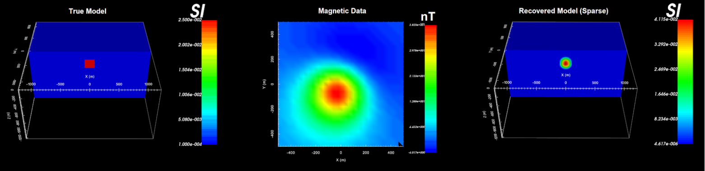

MAG3D v6.0 package
==================

MAG3D v6.0 is a program library for carrying out 3D forward modelling and inversion of magnetic data.

     True model, magnetic data and the recovered model.

**Highlights of Mag3D v6.0**

Many advancements have been made since the previous version of this coding package.
Highlights of Mag3D v6.0 include:

    - the ability to forward model and invert surface, borehole, and airborne magnetic data in 3D
    - the ability to forward model and invert both total magnetic intensity and amplitude data
    - sensitivity weighting so that targets recovered through inversion are placed at the correct depth
    - the ability to recover compact and/or blocky models using sparse norms, in additional to smooth models using a standard least-squares approach
    - implementing wavelet compression to reduce the storage cost of the sensitivity matrix and allow the user to solve larger problems

**Webpage Contents:**

.. toctree::
    :numbered:
    :maxdepth: 2

    Package overview <content/overview>    
    Background theory <content/theory>
    Elements <content/elements>    
    Running the programs <content/runPrograms>
    Example with TMI Data <content/examples_tmi>
    Example with Amplitude Data <content/examples_amp>
    References <references>
  
.. Examples need to be performed (nutcracker?)  
..    Examples <content/examples>
